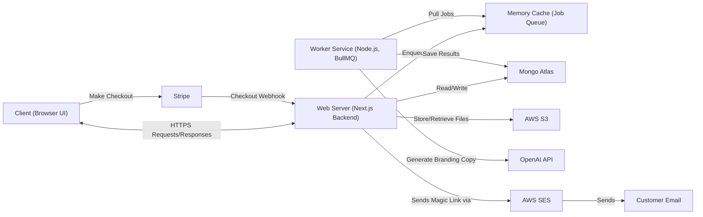

# **ARCHITECTURE**

This document describes the high-level architecture of the BrandKitPilot app. The system is built on Next.js for the full-stack web server, backed by MongoDB, with a separate Node.js worker service for asynchronous AI-powered brand kit generation. The web server handles HTTP requests, authentication (Better Auth), payments (Stripe), and file storage (AWS S3), while offloading long-running OpenAI generation jobs to a BullMQ worker queue backed by Valkey. Transactional emails are sent via AWS SES in production and Mailpit in development.

## **Tech Stack**

| **Technology** | **Roles** |
| --- | --- |
| Next JS | Frontend + Backend |
| Prisma | ORM |
| MongoDB | Database |
| Stripe | Payments |
| OpenAI API | LLM |
| BullMQ | Worker Queue |
| Better Auth | Authentication |
| AWS S3 | File Simple Storage |
| Valkey | Memory Cache |
| AWS SES | Production Email |
| Axllent Mailpit | Development/Test Email |
| Docker | Local development/test deployments |

## **High Level Architecture Diagram**

Below is a Mermaid chart that describes the application’s high level components and systems and how they interact

