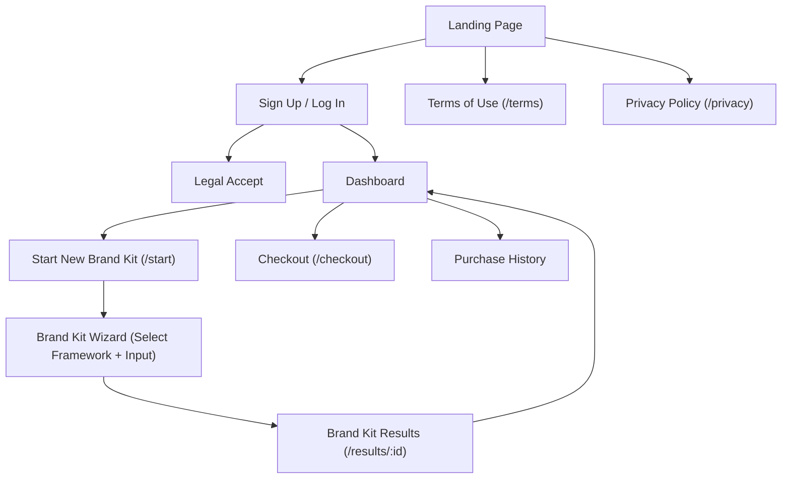

# **UI**

This document describes the UI design of the BrandKitPilot app, covering the pages, their routes, authentication requirements, rendering strategies, and overall site navigation structure.

## **Pages**

| Page Name | URL Route | Auth | Purpose | Rendering Strategy |
| --- | --- | --- | --- | --- |
| Legal Accept | /legal/accept | User | Fetch latest legal docs and prompt user to agree | SSR |
| Privacy Policy | /privacy | Anonymous | Required for compliance | SSG |
| Terms of Use | /legal | Anonymous | Required for compliance | SSG |
| Purchase History | /purchases | User | List payments | SSR |
| Checkout | /checkout | User | Stripe checkout for buying tokens | SSG |
| Brand Kit Results | /results/[id] | User | Show generated copy with automatic refresh while status is pending | SSR |
| Brand Kit Wizard | /start | User | Select framework, fill inputs via guided wizard | SSG |
| Dashboard | /dashboard | User | Show Token Balance, purchase more tokens, CTA | SSR |
| Sign Up / Log In | /login | Anonymous | Auth via email or OAuth (Better-Auth) | SSG |
| Landing Page | / | Anonymous | Describe product, get signups | SSG |

## **Site Map**

📌 **Note:** *"Terms of Use" and "Privacy Policy" are accessible via a persistent footer on all pages, even if only shown linked from the Landing Page here for simplicity.*
