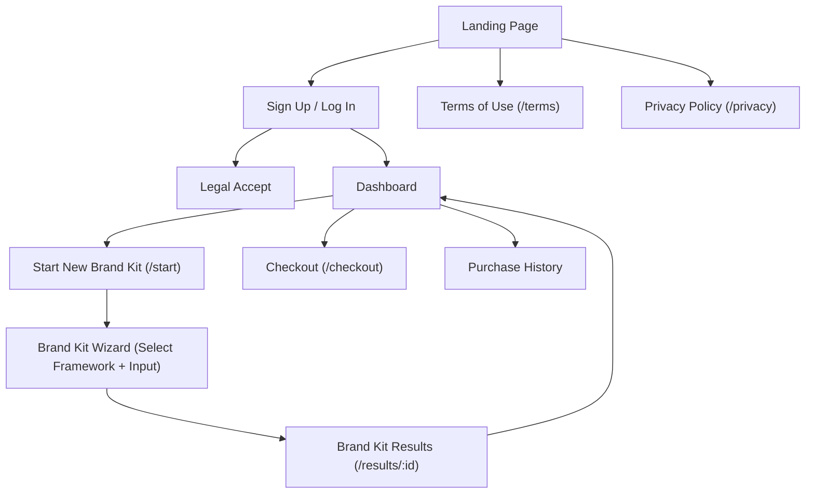

# **UI**

This document describes the UI design of the BrandKitPilot app, covering the pages, their routes, authentication requirements, rendering strategies, and overall site navigation structure.

## **Pages**

| Page Name | URL Route | Auth | Purpose | Rendering Strategy |
| --- | --- | --- | --- | --- |
| Legal Accept | /legal/accept | User | Fetch latest legal docs and prompt user to agree | SSR |
| Privacy Policy | /privacy | Anonymous | Required for compliance | SSG |
| Terms of Use | /legal | Anonymous | Required for compliance | SSG |
| Purchase History | /purchases | User | List payments | SSR |
| Checkout | /checkout | User | Stripe checkout for buying tokens | SSG |
| Brand Kit Results | /results/[id] | User | Show generated copy with automatic refresh while status is pending | SSR |
| Brand Kit Wizard | /start | User | Select framework, fill inputs via guided wizard | SSG |
| Dashboard | /dashboard | User | Show Token Balance, purchase more tokens, CTA | SSR |
| Sign Up / Log In | /login | Anonymous | Auth via email or OAuth (Better-Auth) | SSG |
| Landing Page | / | Anonymous | Describe product, get signups | SSG |

## **Site Map**

📌 **Note:** *"Terms of Use" and "Privacy Policy" are accessible via a persistent footer on all pages, even if only shown linked from the Landing Page here for simplicity.*
## Brand Kit Results Page - Polling Mechanism

The **Brand Kit Results** page (`/results/[id]`) implements automatic polling to display real-time updates as the brand kit generation completes:

### Initial Load
- Server-side rendering (`SSR`) fetches the current brand kit status on page load
- If status is `PENDING`, a client-side polling component takes over
- If status is `COMPLETED` or `FAILED`, the appropriate content is displayed immediately

### Client-Side Polling
When a brand kit is in `PENDING` state:
- **Polling starts automatically** with a 2-second interval
- The interval uses **exponential backoff**: 2s → 4s → 8s → 16s → 30s
- The client component calls the `getBrandKitStatus` Server Function to fetch updates
- **Polling stops automatically** when:
  - Status reaches a terminal state (`COMPLETED` or `FAILED`)
  - Component unmounts (e.g., user navigates away)
  - Connection errors occur 5+ consecutive times

### Error Handling
- Graceful error handling with visual feedback (error count indicator)
- Automatic retry with exponential backoff prevents server overload
- Users can manually refresh if polling fails

### User Experience
- Initial page load shows pending state with processing message
- Results automatically appear without manual refresh when generation completes
- Failed generations display an appropriate error message
- Error indicators help users understand when retries are occurring