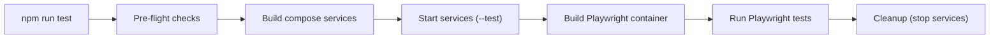

# DEVELOPMENT

## Quick Start

```bash
# 1. Copy environment template
cp .env.example .env.development.local
# Edit .env.development.local with your credentials

# 2. Start development services
npm run start-services

# 3. In another terminal, start the Next.js dev server
npm run dev
```

## Docker

Docker is used **exclusively for local development and testing**. It is not part of the production deployment. All Docker configuration lives in the `docker/` directory and is orchestrated via `docker-compose.yml`, which uses Docker Compose profiles to separate development and test concerns.

### Compose Profiles

The `docker-compose.yml` defines two profiles, selected at runtime by `scripts/services.sh`:

| Profile | Activated by | Purpose |
| --- | --- | --- |
| `development` | `npm run start-services` (default) | Full local dev environment |
| `test` | `npm run start-services -- --test` | Isolated test environment |

### Services

| Service | Image | Profile(s) | Ports | Purpose |
| --- | --- | --- | --- | --- |
| `mongodb-dev` | `prismagraphql/mongo-single-replica:5.0.3` | `development` | 27017 | MongoDB for local development (persisted volume) |
| `mongodb-test` | `prismagraphql/mongo-single-replica:5.0.3` | `test` | 27017 | MongoDB for test runs (ephemeral) |
| `mailpit-dev` | `axllent/mailpit` | `development` | 1025 (SMTP), 8025 (Web UI) | Captures outbound emails locally; view magic links at http://localhost:8025 |
| `mailpit-test` | `axllent/mailpit` | `test` | 1025 (SMTP), 8025 (Web UI) | Captures emails during E2E test runs |
| `memory-cache` | `valkey/valkey:latest` | both | 6379 | Valkey instance for the BullMQ job queue |
| `worker` | `docker/Dockerfile.worker` | both | — | Runs the BullMQ worker process locally alongside the Next.js dev server |
| `stripe-cli` | `stripe/stripe-cli:latest` | both | — | Forwards Stripe webhook events to the local server |

### Service Management

All service management is done through `scripts/services.sh`:

```bash
# Start services (foreground - shows logs)
npm run start-services

# Start services (background)
npm run start-services -- --detached
npm run start-services -- -d

# Start test environment
npm run start-services -- --test -d

# Stop services
npm run stop-services

# View running services
npm run services:status

# View logs
npm run services:logs              # All services
npm run services:logs -- worker    # Specific service

# Build/rebuild service images
npm run build-services
```

### E2E Test Execution

The `npm run test` script (`scripts/test.sh`) orchestrates the full test lifecycle:



The Playwright container (`Dockerfile.playwright`) is built from `mcr.microsoft.com/playwright` to include all required browser binaries. Tests run with `--network=host` so the container can reach the Next.js dev server and Mailpit on localhost.

**Test Commands:**

```bash
# Run all tests
npm run test

# Run specific test file
npm run test -- magiclink.spec.ts

# Run with visible browser (requires X11)
npm run test:headed

# Run with Playwright debug mode
npm run test:debug

# Skip container rebuilds (faster iteration)
npm run test:fast
```

### Environment Variables

Each compose service is configured via the `ENV_FILE` variable, which points to the appropriate `.env.{NODE_ENV}.local` file on the host. This keeps secrets out of the Docker image and the `docker/` directory. The `docker/.env` file contains only non-secret Docker Compose variables (e.g. `FORWARD_TO` for the Stripe CLI).

**Environment Files:**
- `.env.example` — Template with all required variables (copy this to create your env files)
- `.env.development.local` — Development environment (local machine)
- `.env.test.local` — Test environment (E2E tests)
- `.env.production.local` — Production environment (if running locally)

### Key Files

| File | Purpose |
| --- | --- |
| `docker/docker-compose.yml` | Service definitions for all local dev and test containers |
| `docker/Dockerfile.worker` | Worker image — installs dependencies, generates Prisma client, runs `start-worker.sh` |
| `docker/Dockerfile.playwright` | Playwright test runner image with browser binaries |
| `docker/.env` | Non-secret Docker Compose variables (e.g. Stripe CLI `FORWARD_TO`) |
| `docker/docker-entrypoint.sh` | Custom entrypoint for the MongoDB dev container |
| `scripts/lib/common.sh` | Shared shell utilities (logging, validation, cleanup) |
| `scripts/lib/env.sh` | Environment variable management utilities |
| `scripts/services.sh` | Manages docker compose lifecycle (build / start / stop / logs / status) |
| `scripts/test.sh` | Full E2E test pipeline: build → start → run Playwright → stop |
| `scripts/generate.sh` | Generate Prisma client and Better Auth schema |
| `scripts/start-worker.sh` | Start BullMQ worker (used inside Docker container) |

## Troubleshooting

### Services won't start

1. Check Docker is running: `docker info`
2. Check for port conflicts: `lsof -i :27017` (MongoDB), `lsof -i :6379` (Redis)
3. View service logs: `npm run services:logs`

### Tests timeout

1. Ensure services are running: `npm run services:status`
2. Check environment file exists: `ls -la .env.test.local`
3. Skip rebuilds for faster iteration: `npm run test:fast`

### Environment variable errors

1. Check your env file matches the template: `diff .env.example .env.development.local`
2. Ensure all required DATABASE_* variables are set
3. Run with debug output: `DEBUG=1 npm run start-services`
