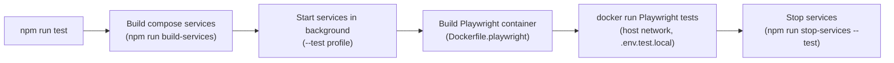

# **DEVELOPMENT**

## **Docker**

Docker is used **exclusively for local development and testing**. It is not part of the production deployment. All Docker configuration lives in the `docker/` directory and is orchestrated via `docker-compose.yml`, which uses Docker Compose profiles to separate development and test concerns.

### **Compose Profiles**

The `docker-compose.yml` defines two profiles, selected at runtime by `scripts/services.sh`:

| Profile | Activated by | Purpose |
| --- | --- | --- |
| `development` | `npm run start-services` (default) | Full local dev environment |
| `test` | `npm run start-services -- --test` | Isolated test environment |

### **Services**

| Service | Image | Profile(s) | Ports | Purpose |
| --- | --- | --- | --- | --- |
| `mongodb-dev` | `prismagraphql/mongo-single-replica:5.0.3` | `development` | 27017 | MongoDB for local development (persisted volume) |
| `mongodb-test` | `prismagraphql/mongo-single-replica:5.0.3` | `test` | 27017 | MongoDB for test runs (ephemeral) |
| `mailpit-dev` | `axllent/mailpit` | `development` | 1025 (SMTP), 8025 (Web UI) | Captures outbound emails locally; view magic links in the browser |
| `mailpit-test` | `axllent/mailpit` | `test` | 1025 (SMTP), 8025 (Web UI) | Captures emails during E2E test runs |
| `memory-cache` | `valkey/valkey:latest` | both | 6379 | Valkey instance for the BullMQ job queue |
| `worker` | `docker/Dockerfile.worker` | both | — | Runs the BullMQ worker process locally alongside the Next.js dev server |
| `stripe-cli` | `stripe/stripe-cli:latest` | both | — | Forwards Stripe webhook events to the local server (`--forward-to`) |

### **E2E Test Execution**

The `npm run test` script (`scripts/test.sh`) orchestrates the full test lifecycle:

The Playwright container (`Dockerfile.playwright`) is built from `mcr.microsoft.com/playwright` to include all required browser binaries. Tests run with `--network=host` so the container can reach the Next.js dev server and Mailpit on localhost.

### **Environment Variables**

Each compose service is configured via the `ENV_FILE` variable, which points to the appropriate `.env.{NODE_ENV}.local` file on the host. This keeps secrets out of the Docker image and the `docker/` directory. The `docker/.env` file contains only non-secret Docker Compose variables (e.g. `FORWARD_TO` for the Stripe CLI).

### **Key Files**

| File | Purpose |
| --- | --- |
| `docker/docker-compose.yml` | Service definitions for all local dev and test containers |
| `docker/Dockerfile.worker` | Worker image — installs dependencies, generates Prisma client, runs `start-worker.sh` |
| `docker/Dockerfile.playwright` | Playwright test runner image with browser binaries |
| `docker/.env` | Non-secret Docker Compose variables (e.g. Stripe CLI `FORWARD_TO`) |
| `docker/docker-entrypoint.sh` | Custom entrypoint for the MongoDB dev container |
| `scripts/services.sh` | Manages `docker compose` lifecycle (build / start / stop) with profile selection |
| `scripts/test.sh` | Full E2E test pipeline: build → start → run Playwright → stop |