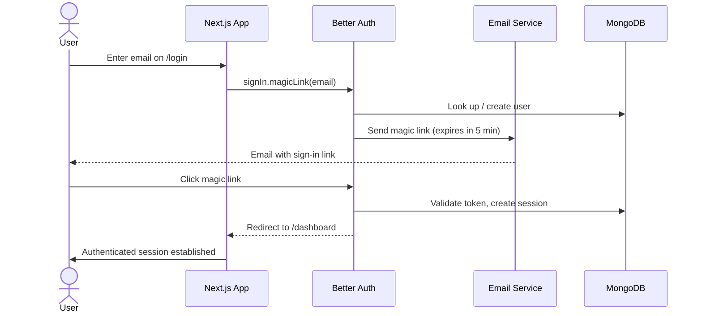

# **Authentication**

This application uses **Better Auth** as the authentication library. Better Auth is a TypeScript-first auth framework that provides a plugin-based architecture, a Prisma adapter, and both server and client SDKs. It is configured in `src/auth/auth.ts` (server) and `src/auth/authClient.ts` (client).

Email/password authentication is explicitly **disabled**. The sole sign-in method is **Magic Links**.

## **Magic Link Flow**

When a user attempts to sign in or sign up, they enter their email address. Better Auth generates a time-limited, single-use URL and sends it to the user via email (AWS SES in production, Mailpit in development). Clicking the link authenticates the user and initiates a session. If no account exists for the given email, one is created automatically on first use.

## **Session Management**

Sessions are stored in MongoDB via the Prisma adapter. Better Auth issues a session cookie on successful authentication, which is validated on every server-side request using `auth.api.getSession()`.

| Parameter | Value | Notes |
| --- | --- | --- |
| Magic link expiry | 5 minutes | Single-use; invalid after first click |
| Session duration | 3 days | Rolling — extended on activity |
| Session update age | 24 hours | Session TTL is refreshed once per day |

## **Role-Based Access**

The application supports two roles, managed by the Better Auth `admin` plugin.

| Role | Description |
| --- | --- |
| `user` | Default role assigned to all new accounts |
| `admin` | Elevated access; required for admin-only DAL functions |

Roles are enforced at the DAL boundary via two server-side session utilities in `src/lib/auth/server/session.ts`:

- **`checkServerAuth`** — verifies a valid session exists; redirects to `/login` if not.
- **`checkAdminAuth`** — verifies session and `admin` role; redirects to `/dashboard` if insufficient privileges.

## **Key Files**

| File | Purpose |
| --- | --- |
| `src/auth/auth.ts` | Server-side Better Auth configuration (plugins, session, email handler) |
| `src/auth/authClient.ts` | Client-side auth client (`magicLinkClient`, `adminClient`) |
| `src/lib/auth/server/session.ts` | Server session helpers (`getServerSession`, `checkServerAuth`, `checkAdminAuth`) |
| `src/lib/auth/client/signin.ts` | Client-facing magic link sign-in action |
| `src/lib/auth/server/createUser.ts` | Server action for admin-initiated account creation |
| `src/lib/auth/roles.ts` | Role constants, types, and helper utilities |

## **Notes**

- The Better Auth configuration is the **only** place in the codebase that is permitted to import the Prisma client directly — this exception is acknowledged in `eslint.config.mjs`.
- Account creation on first sign-in (`disableSignUp: false`) means the `/signup` page creates the account record ahead of time via `createUser`, but a magic link is still required to establish a session.
- The `openAPI` plugin exposes a `/api/auth/reference` endpoint for the Better Auth REST API schema, which is useful during development.