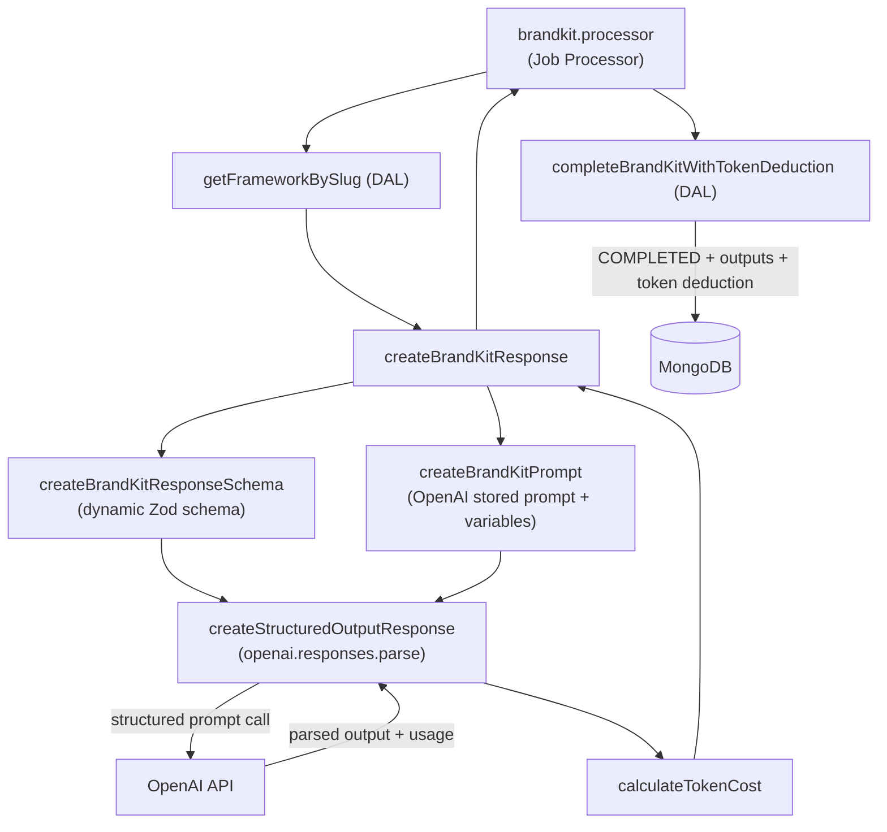

# **BrandKit Generation**

Brand kit content is generated by calling the **OpenAI Responses API** with structured output. The main entrypoint is `createBrandKitResponse` in `src/lib/ai/responses.ts`, which is called from the worker's job processor (`brandkit.processor.ts`) after the job is dequeued.

## **Generation Flow**



## **Prompt Strategy**

Prompts are managed as **stored prompts in the OpenAI dashboard** rather than being hardcoded in the application. `createBrandKitPrompt` assembles a prompt reference by combining:

- A stored prompt ID (`CREATE_BRANDKIT_PROMPT_ID` from server env)
- Four dynamic variables injected at runtime:

| Variable | Source |
| --- | --- |
| `framework` | `BrandFramework.name` from the database |
| `context` | `BrandFramework.promptContext` (optional per-framework guidance) |
| `outputsections` | Comma-separated list of `BrandFramework.outputSections[].title` |
| `userinputs` | JSON-serialised array of `{ label, value }` pairs from the user |

This approach keeps prompts editable in the OpenAI dashboard without requiring a code deployment.

## **Structured Output**

The response schema is **generated dynamically** from the framework's `outputSections` at runtime using `createBrandKitResponseSchema`. Each section title becomes a required `z.string()` key on the schema, ensuring the AI always returns exactly the sections the framework defines. The schema is passed to `openai.responses.parse()` via `zodTextFormat`, which instructs the API to return validated, type-safe structured output.

The parsed response shape:

```tsx
{
  title: string           // AI-generated brand kit title
  sections: {
    [sectionTitle]: string  // one key per framework output section
  }
}
```

### Title Persistence and Polling

The AI-generated `title` is persisted to the database when the job completes via `completeBrandKitWithTokenDeduction`. When a user waits on the `/results/:id` page for generation to finish, the client polls using `getBrandKitStatus`, which returns `{ status, outputs, title }`. The `ResultsPageClient` updates its local state with the new title when the status changes to `COMPLETED`, so the user sees the AI-generated title without needing to refresh the page.

## **Token Cost Calculation**

After a successful API call, the actual USD cost is calculated from the usage data returned by OpenAI (`input_tokens`, `cached_tokens`, `output_tokens`) using per-model pricing defined in `utils.ts`. The cost is converted to in-app tokens using the conversion rate `TOKENS_PER_USD` and deducted atomically from the user's balance alongside saving the outputs.

| Model | Input (per 1M) | Cached Input (per 1M) | Output (per 1M) |
| --- | --- | --- | --- |
| `gpt-5-mini-2025-08-07` *(active)* | $0.25 | $0.025 | $2.00 |
| `gpt-5-nano-2025-08-07` | $0.05 | $0.005 | $0.40 |
| `gpt-5.1-2025-11-13` | $1.25 | $0.125 | $10.00 |

The active model is set by `OPENAI_MODEL` in `src/lib/ai/const.ts`.

## **Error Handling**

If generation fails at any point, `processBrandKitJob` catches the error, calls `updateBrandKitById` to mark the `BrandKit` as `FAILED`, and returns a `ProcessingResult` with `success: false`. The `/results/:id` page can surface this status to the user.

## **Key Files**

| File | Purpose |
| --- | --- |
| `src/lib/ai/responses.ts` | `createBrandKitResponse` — main entrypoint; builds schema, calls OpenAI, returns output + cost |
| `src/lib/ai/openai.ts` | `createStructuredOutputResponse` — thin wrapper around `openai.responses.parse` |
| `src/lib/ai/prompts.ts` | `createBrandKitPrompt` — assembles stored prompt reference with runtime variables |
| `src/lib/ai/types.ts` | Shared types: `BrandKitInput`, `BrandKitOutput`, `AIResponse`, `OpenAIPrompt` |
| `src/lib/ai/utils.ts` | `calculateTokenCost` and per-model pricing table |
| `src/lib/ai/const.ts` | Active model, max tokens, temperature constants |
| `src/lib/worker/brandkit.processor.ts` | Job processor — orchestrates framework lookup, generation, and DAL writes |
| `src/lib/dal/brandkits.ts` | `completeBrandKitWithTokenDeduction` — atomically saves outputs, marks COMPLETED, deducts tokens |
