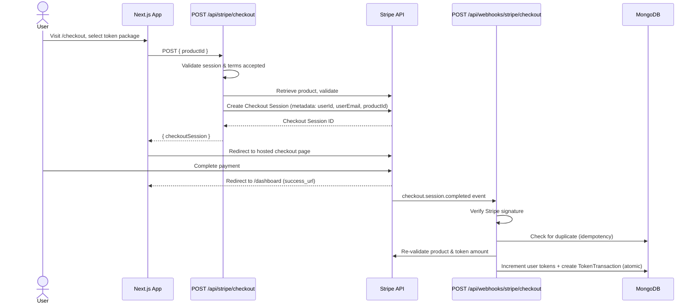

# **Payments**

The application uses **Stripe Checkout** (hosted payment page) to sell token packages to users. Tokens are the in-app currency consumed when generating a brand kit. Products and pricing are managed entirely in the Stripe dashboard — there is no product table in the database.

## **Token Products**

Each Stripe product carries a `tokens` field in its metadata that determines how many tokens are granted upon purchase. `getProducts` fetches active products from the Stripe API at request time and maps them to the UI. Products missing a `tokens` metadata value or an active default price are silently skipped.

## **Checkout Flow**

## **Fulfillment**

Token fulfillment happens exclusively via webhook, not on the redirect. This ensures tokens are credited even if the user closes the browser before being redirected. The webhook handler at `/api/webhooks/stripe/checkout` listens for two event types:

| Event | Trigger |
| --- | --- |
| `checkout.session.completed` | Synchronous card payments |
| `checkout.session.async_payment_succeeded` | Async payment methods (bank transfers, etc.) |

On receipt, `fulfillCheckout` runs the following steps:

1. Checks the `stripeSessionId` against existing `TokenTransaction` records — if found, returns early (idempotent).
2. Verifies `payment_status !== "unpaid"`.
3. Parses and validates the session metadata (`userId`, `userEmail`, `productId`) against a Zod schema.
4. Re-fetches and validates the product from Stripe to get the authoritative token amount.
5. Executes an atomic Prisma transaction: increments `User.tokens` and creates a `TokenTransaction` record of type `PURCHASE`.

## **Idempotency**

Two layers protect against duplicate credits:

- **Checkout session creation** — the `POST /api/stripe/checkout` endpoint uses a 5-minute windowed idempotency key (`checkout_{userId}_{productId}_{timestamp}`) when calling `stripe.checkout.sessions.create`, preventing duplicate sessions from rapid re-clicks.
- **Fulfillment** — the `TokenTransaction.stripeSessionId` field has a `@@unique` constraint. Stripe may deliver a webhook more than once; `fulfillCheckout` detects the duplicate and returns a `200` without re-crediting tokens.

## **Security**

- The webhook signature is verified using `stripe.webhooks.constructEvent()` with `STRIPE_WEBHOOK_SECRET` before any processing occurs. Requests with missing or invalid signatures are rejected with `400`.
- The checkout API requires an authenticated session and checks that the user has accepted the current terms before creating a session.
- Product validation (active status, price, tokens metadata) is performed server-side via Zod schemas — the client only supplies a `productId`.

## **Key Files**

| File | Purpose |
| --- | --- |
| `src/app/checkout/page.tsx` | Checkout page — fetches and renders token packages |
| `src/app/api/stripe/checkout/route.ts` | Creates Stripe Checkout Sessions |
| `src/app/api/webhooks/stripe/checkout/route.ts` | Handles incoming Stripe webhook events |
| `src/lib/stripe/fulfillCheckout.ts` | Orchestrates post-payment token fulfillment |
| `src/lib/stripe/getProducts.ts` | Fetches and maps active Stripe products |
| `src/lib/stripe/validateStripeProduct.ts` | Zod-based product validation |
| `src/lib/stripe/validateCheckoutRequest.ts` | Zod-based checkout request validation |
| `src/lib/stripe/TokenCheckoutSessionMetaSchema.ts` | Zod schema for Stripe session metadata |
| `src/hooks/useCheckout.ts` | Client-side hook that calls the checkout API and redirects to Stripe |
| `src/lib/dal/tokens.ts` | DAL functions for crediting/deducting tokens and idempotency checks |