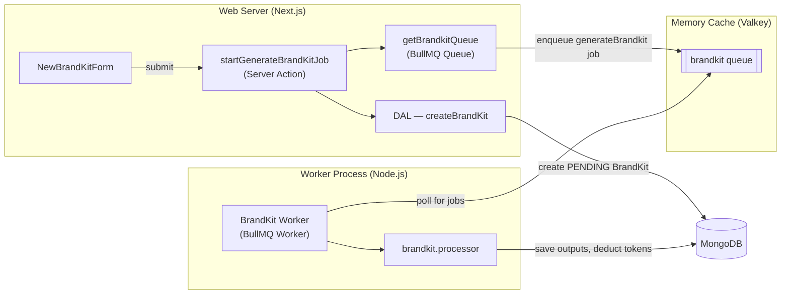

## **Worker Queues**

Brand kit generation is handled asynchronously by a **dedicated worker process** running outside the Next.js server. The queue system is built on **BullMQ**, a Node.js queue library, backed by **Valkey** (a Redis-compatible in-memory store) as the job broker.

Offloading generation to a worker keeps the web server responsive — the user is redirected to `/results/:id` immediately after job submission, and the page polls or renders once the job completes.

### **Architecture**

The web server and the worker are **separate processes**. They communicate exclusively through Valkey.



### **Queue and Job**

There is currently one queue and one job type in the system.

| Name | Value |
| --- | --- |
| Queue name | `brandkit` |
| Job name | `generateBrandkit` |

**Job payload** (validated with Zod before enqueuing):

```tsx
{
  userId: string
  frameworkSlug: string
  inputs: { label: string; value: string }[]
  brandKitId: string   // added by the server action after BrandKit record creation
}
```

### **Job Lifecycle**

1. **User submits** the brand kit form on `/start`.
2. The `startGenerateBrandKitJob` Server Action validates the input with Zod, calls `createBrandKit` (DAL) to persist a `PENDING` `BrandKit` record, then pushes a `generateBrandkit` job onto the queue with the new `brandKitId` in the payload.
3. The user is redirected to `/results/:id` immediately.
4. The **worker** picks up the job, runs `processBrandKitJob`, and on completion calls `completeBrandKitWithTokenDeduction` (DAL) — which atomically marks the `BrandKit` as `COMPLETED`, saves the generated outputs, and deducts tokens from the user.
5. On failure, `updateBrandKitById` marks the record as `FAILED`.

### **Worker Process**

The worker runs as a long-lived Node.js process (`src/lib/worker/brandkit.worker.ts`), separate from Next.js. It is started via the `start-worker.sh` script.

| Setting | Value |
| --- | --- |
| Concurrency | 3 (up to 3 jobs processed in parallel per worker instance) |
| Graceful shutdown | Listens for `SIGTERM` / `SIGINT`; closes the BullMQ worker and Redis connection before exiting |

`createWorker` in `worker.setup.ts` is a generic factory that accepts a queue name, concurrency, and a job processor function, keeping the worker bootstrap code decoupled from any specific job logic.

### **Redis Connection**

Both the web server (for enqueuing) and the worker (for polling) share the same Redis connection logic via `RedisConnectionManager` — a singleton class in `src/lib/redis/connection.ts`. It uses `ioredis` under the hood with BullMQ-required settings (`maxRetriesPerRequest: null`, `enableReadyCheck: false`, lazy connect) and reconnects automatically on transient errors.

### **Key Files**

| File | Purpose |
| --- | --- |
| `src/lib/queue/actions.ts` | `startGenerateBrandKitJob` Server Action — validates input, creates BrandKit record, enqueues job |
| `src/lib/queue/queue.ts` | Lazy-initialized BullMQ `Queue` instance |
| `src/lib/queue/const.ts` | Queue and job name constants |
| `src/lib/queue/schemas.ts` | Zod schema for job payload validation |
| `src/lib/worker/brandkit.worker.ts` | Worker entry point — initialises worker, sets up event handlers and graceful shutdown |
| `src/lib/worker/worker.setup.ts` | Generic `createWorker` factory and `setupGracefulShutdown` utility |
| `src/lib/worker/brandkit.processor.ts` | Job processor — orchestrates AI generation and database writes |
| `src/lib/redis/connection.ts` | `RedisConnectionManager` singleton (ioredis, BullMQ-optimised config) |