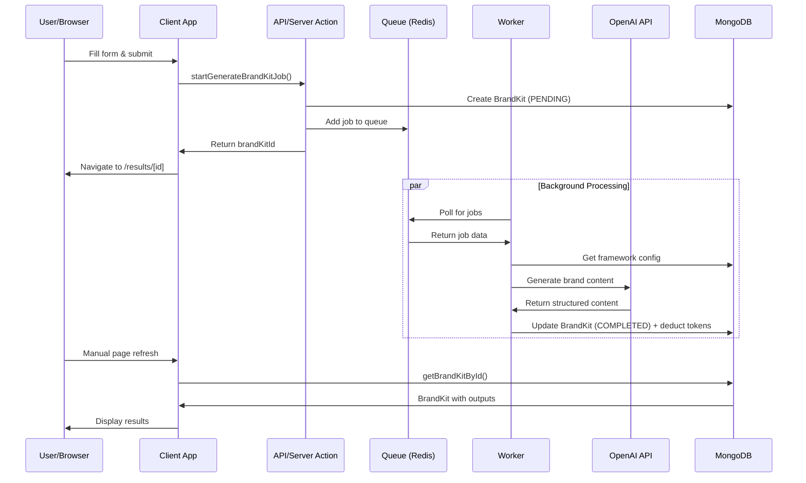

# BrandKit Generation Flow

This document provides a comprehensive overview of how brand kits are generated in the BrandKitPilot application, from user interaction to final completion.

## High-Level Overview

### What is BrandKit Generation?

BrandKit generation is the core feature of the application where users provide business information through structured forms, and the system uses AI (OpenAI GPT models) to generate comprehensive brand assets including slogans, color palettes, typography suggestions, brand voice guidelines, and marketing copy.

### Major Components

- **Client App (Next.js)**: Handles user interaction, form submission, and result display
- **Queue System (BullMQ + Redis)**: Manages background job processing for scalability
- **Worker Service**: Processes jobs asynchronously, calls AI services, manages state
- **Database (MongoDB via Prisma)**: Stores user data, brand kits, frameworks, and token transactions
- **AI Service (OpenAI API)**: Generates brand content based on structured prompts and frameworks

## Step-by-Step Flow

### 1. User Initiates Brand Kit Creation
- **Location**: [src/app/start/page.tsx](src/app/start/page.tsx)
- **Component**: [`NewBrandKitForm`](src/components/NewBrandKitForm.tsx)
- **Action**: User selects a branding framework and fills out required fields

### 2. Form Validation and Submission
- **File**: [src/components/NewBrandKitForm.tsx](src/components/NewBrandKitForm.tsx)
- **Function**: `handleSubmit()`
- **Actions**:
  - Validates form data and required fields
  - Checks user authentication via `authClient.useSession()`
  - Transforms form data into `BrandKitRequestData` format
  - Calls `startGenerateBrandKitJob()` server action

### 3. Server Action Processing
- **File**: [src/lib/queue/actions.ts](src/lib/queue/actions.ts)
- **Function**: `startGenerateBrandKitJob()`
- **Actions**:
  - Validates request data using `BrandKitRequestDataSchema`
  - Creates initial `BrandKit` record in database with `PENDING` status via `createBrandKit()`
  - Adds job to BullMQ queue with combined data (user inputs + brandKitId)
  - Returns `brandKitId` to client for navigation

### 4. Queue Job Addition
- **File**: [src/lib/queue/queue.ts](src/lib/queue/queue.ts)
- **Function**: `getBrandkitQueue()`
- **Queue**: `BRANDKIT_QUEUE_NAME` ("brandkit")
- **Job Name**: `GENERATE_BRANDKIT_JOB_NAME` ("generateBrandkit")
- **Actions**:
  - Establishes Redis connection for job queue
  - Enqueues job with `ProcessBrandKitJobData` payload

### 5. Client Navigation
- **Location**: [src/components/NewBrandKitForm.tsx](src/components/NewBrandKitForm.tsx)
- **Action**: User redirected to `/results/${createdBrandKitId}` for status tracking

### 6. Background Worker Processing
- **File**: [src/lib/worker/brandkit.worker.ts](src/lib/worker/brandkit.worker.ts)
- **Function**: `startBrandKitWorker()`
- **Concurrency**: 3 concurrent jobs
- **Actions**:
  - Worker picks up job from queue
  - Delegates processing to `processBrandKitJob()`

### 7. Job Processing Logic
- **File**: [src/lib/worker/brandkit.processor.ts](src/lib/worker/brandkit.processor.ts)
- **Function**: `processBrandKitJob()`
- **Steps**:
  1. Validates job data and retrieves framework via `getFrameworkBySlug()`
  2. Calls `createBrandKitResponse()` for AI content generation
  3. Processes AI response and calculates token cost
  4. Updates database atomically via `completeBrandKitWithTokenDeduction()`

### 8. AI Content Generation
- **File**: [src/lib/ai/responses.ts](src/lib/ai/responses.ts)
- **Function**: `createBrandKitResponse()`
- **Model**: `gpt-5-mini-2025-08-07` (configurable in [src/lib/ai/const.ts](src/lib/ai/const.ts))
- **Steps**:
  1. Creates dynamic Zod schema based on framework output sections
  2. Builds structured prompt using framework context and user inputs
  3. Calls OpenAI Structured Output API via `createStructuredOutputResponse()`
  4. Calculates token cost and returns parsed response

### 9. Database Completion Transaction
- **File**: [src/lib/dal/brandkits.ts](src/lib/dal/brandkits.ts)
- **Function**: `completeBrandKitWithTokenDeduction()`
- **Atomic Operations**:
  1. Updates `BrandKit` status to `COMPLETED` with generated outputs
  2. Deducts tokens from user account
  3. Creates `TokenTransaction` record for audit trail

### 10. Result Display
- **File**: [src/app/results/[id]/page.tsx](src/app/results/[id]/page.tsx)
- **Function**: `ResultsPage` (Server Component)
- **Actions**:
  - Fetches brand kit by ID via `getBrandKitById()`
  - Renders status badge and content based on `BrandKitStatus`
  - **Note**: No client-side polling - users must refresh manually to see updates

## Function-Level Trace

### Client App Chain
1. `NewBrandKitForm.handleSubmit()` → `startGenerateBrandKitJob()`
2. `startGenerateBrandKitJob()` → `createBrandKit()` + queue job
3. Navigation to `ResultsPage` → `getBrandKitById()`

### Worker Service Chain
1. `BullMQ Worker` → `processBrandKitJob()`
2. `processBrandKitJob()` → `getFrameworkBySlug()` + `createBrandKitResponse()`
3. `createBrandKitResponse()` → `createStructuredOutputResponse()` (OpenAI API)
4. `processBrandKitJob()` → `completeBrandKitWithTokenDeduction()`

### Key Data Access Layer (DAL) Functions
- **[src/lib/dal/brandkits.ts](src/lib/dal/brandkits.ts)**:
  - `createBrandKit()`: Creates initial pending record
  - `getBrandKitById()`: Retrieves brand kit for display
  - `completeBrandKitWithTokenDeduction()`: Atomic completion with token handling
- **[src/lib/dal/brandFrameworks.ts](src/lib/dal/brandFrameworks.ts)**:
  - `getFrameworkBySlug()`: Retrieves framework configuration
- **[src/lib/dal/tokens.ts](src/lib/dal/tokens.ts)**:
  - Token cost calculation: `TOKENS_PER_USD` constant

## Services Used

### Client App Responsibilities
- **Form Management**: Input validation, framework selection, user feedback
- **Authentication**: Session management via Better Auth (`authClient.useSession()`)
- **Navigation**: Route management between form submission and results
- **Result Display**: Server-side rendering of brand kit content and status

### Worker/Service Responsibilities
- **Job Queue Management**: BullMQ with Redis for reliable background processing
- **AI Integration**: OpenAI API calls with structured output parsing
- **Database Transactions**: Atomic updates for data consistency
- **Token Management**: Cost calculation and user account deduction
- **Error Handling**: Job failure management and status updates

### External Services

#### OpenAI API
- **Purpose**: Generate brand content using GPT models
- **Called From**: [src/lib/ai/openai.ts](src/lib/ai/openai.ts) `createStructuredOutputResponse()`
- **Input**: Structured prompts with framework context and user responses
- **Output**: Parsed JSON with brand sections (slogans, colors, typography, etc.)
- **Cost Tracking**: Token usage monitoring for billing

#### Redis/Valkey (BullMQ)
- **Purpose**: Job queue and caching for background processing
- **Called From**: [src/lib/queue/queue.ts](src/lib/queue/queue.ts) `getBrandkitQueue()`
- **Configuration**: Connection via [src/lib/redis/connection.ts](src/lib/redis/connection.ts)

#### MongoDB (via Prisma)
- **Purpose**: Primary data persistence layer
- **Schema**: [prisma/schema.prisma](prisma/schema.prisma)
- **Connection**: [src/db/db.ts](src/db/db.ts)

## Data & State Management

### Core Data Objects

#### BrandKit Model
```typescript
{
  id: string              // MongoDB ObjectId
  userId: string          // Owner reference
  title: string           // Display name
  status: BrandKitStatus  // PENDING | COMPLETED | FAILED
  outputs: BrandKitOutputSection[] // Generated content sections
}
```

#### BrandKitOutputSection
```typescript
{
  title: string    // Section name (e.g., "Brand Slogan")
  content: string  // Generated content
}
```

### State Transitions
1. **Initial**: `BrandKit` created with `status: PENDING`, empty `outputs: []`
2. **Processing**: Job queued in Redis, worker begins AI generation
3. **Success**: `status: COMPLETED`, populated `outputs`, tokens deducted
4. **Failure**: `status: FAILED`, empty `outputs`, no token deduction

### Source of Truth
- **BrandKit Status**: MongoDB `brandkit` collection via Prisma
- **Job Status**: Redis queue managed by BullMQ
- **User Tokens**: MongoDB `user` collection `tokens` field
- **Transaction History**: MongoDB `token_transaction` collection

## Error Handling & Retries

### Client-Side Error Handling
- **File**: [src/components/NewBrandKitForm.tsx](src/components/NewBrandKitForm.tsx)
- **Mechanism**: Try-catch wrapper in `handleSubmit()`
- **User Feedback**: Error state with descriptive messages
- **Common Errors**: Validation failures, authentication issues, network errors

### Worker Error Handling
- **File**: [src/lib/worker/brandkit.processor.ts](src/lib/worker/brandkit.processor.ts)
- **Mechanism**: Comprehensive try-catch with status update
- **Failure Actions**:
  1. Updates `BrandKit.status` to `FAILED`
  2. Logs detailed error information
  3. Returns structured error result to queue
- **No Token Deduction**: Failed jobs don't consume user tokens

### Retry Behavior
- **Queue Level**: BullMQ default retry mechanism (configurable)
- **AI API**: **Unknown/To verify** - retry logic not explicitly found in codebase
- **Database**: Prisma connection retry handled by driver

### UI During Failures
- **Pending State**: "Processing Your Brand Kit" with manual refresh instruction
- **Failed State**: "Generation Failed" with suggestion to try again or contact support
- **No Polling**: Users must manually refresh page to see status changes

## Architecture Diagram



## Performance Considerations

- **Queue Concurrency**: 3 workers process jobs simultaneously
- **AI Response Time**: Typically 10-30 seconds per brand kit
- **Database Transactions**: Atomic operations prevent inconsistent state
- **No Real-time Updates**: Manual refresh required (trade-off for simplicity)

## Development Notes

- **Worker Management**: Use `scripts/start-worker.sh` for local development
- **Queue Monitoring**: BullMQ provides dashboard capabilities (configuration needed)
- **Testing**: See [tests/specs/](tests/specs/) for AI response validation
- **Environment**: Multiple `.env.*.local` files for different stages